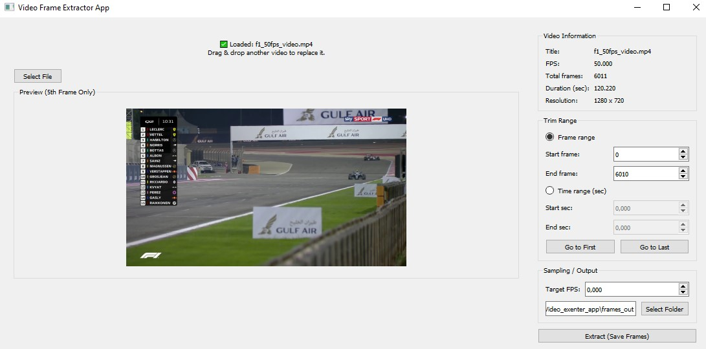

[README.md](https://github.com/user-attachments/files/24484172/README.md)
# 🎬 Video Frame Extractor 

A desktop GUI application built with **PyQt5** and **OpenCV** to extract frames from videos with precise control over **frame ranges**, **time ranges**, and **sampling FPS**.

This tool is designed for **computer vision**, **machine learning preprocessing**, **video analysis**, and **dataset preparation** workflows.

---

## 🖼️ Screenshot

---

## ✨ Features

- 📂 Drag & Drop video loading
- 👀 Responsive preview  
  - Displays **only the 5th frame** of the video  
  - Automatically scales with window size
- ℹ️ Video metadata display
  - FPS
  - Total frames
  - Duration (seconds)
  - Resolution
- ✂️ Trim by **Frame Range**
- ⏱️ Trim by **Time Range (seconds)**
- ⏮️ **Go to First** / ⏭️ **Go to Last** buttons
- 🎯 Target FPS sampling  
  - `0` = extract **all frames**
- 📁 Custom output directory
- 📊 Progress bar during extraction
- 🧵 Background processing (non-blocking UI)

---

## 📂 Repository Structure

video-frame-extractor/
│
├── example_image.jpg # Screenshot used in README
├── video_frame_extractor_raw_code.py # Core / raw extraction logic
├── video_frame_tool_gui_tr.py # Turkish GUI version
├── video_frame_tool_gui_eng_full.py # English GUI version (full-featured)
└── README.md

---

## ▶️ Usage

### English Version
python video_frame_tool_gui_eng_full.py

Turkish Version
python video_frame_tool_gui_tr.py

🧰 Requirements
Python 3.9+

PyQt5

OpenCV

Install dependencies:
pip install pyqt5 opencv-python

🧠 How It Works
Load a video via drag & drop or Select File

The app automatically previews the 5th frame

Choose trim mode:

Frame range (e.g. 100 → 500)

Time range (e.g. 2.5 → 10.0 seconds)

Use Go to First / Go to Last for quick range setup

Set Target FPS

Choose output folder

Click Extract (Save Frames)

Frames are saved as indexed .jpg files.

📤 Output Format
Example filename:

frame_000120_000015.jpg
First number → original frame index

Second number → extracted frame counter

🚀 Use Cases
Computer Vision dataset creation

Machine Learning preprocessing

Video sampling & analysis

Annotation pipelines

Debugging video streams

